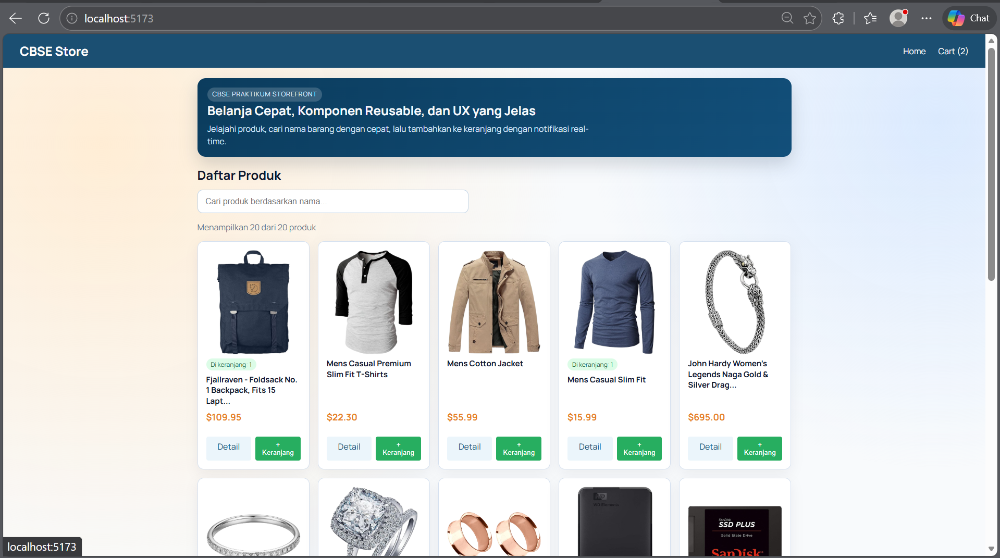
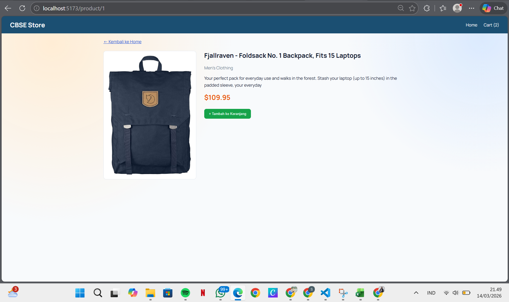
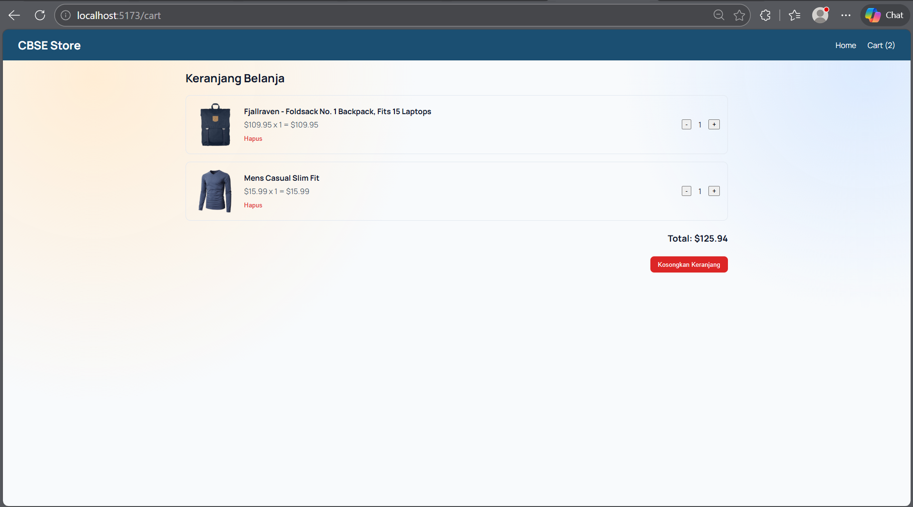

# Ecommerce App - Praktikum CBSE Pertemuan 5

Proyek ini dibuat untuk memenuhi modul praktikum CBSE tentang software component, library, dan framework menggunakan React + Vite.

## Fitur Utama

- Menampilkan daftar produk dari Fake Store API (axios).
- Halaman detail produk berdasarkan ID (`useParams` dari `react-router-dom`).
- Fitur pencarian produk berdasarkan nama pada halaman Home.
- Keranjang belanja dengan update quantity (`+` dan `-`).
- Notifikasi saat produk berhasil ditambahkan ke keranjang.

## Tech Stack

- React (Framework)
- Vite (Build tool)
- Axios (Library HTTP client)
- React Router DOM (Routing)

## Struktur Folder

```text
src/
	components/
		Header.jsx
		ProductCard.jsx
		CartItem.jsx
		SearchBar.jsx
		Loading.jsx
	pages/
		Home.jsx
		ProductDetail.jsx
		Cart.jsx
	services/
		api.js
	context/
		CartContext.jsx
```

## Menjalankan Project

```bash
npm install
npm run dev
```

Build production:

```bash
npm run build
```

## Screenshot Halaman

Simpan file screenshot di folder `docs/screenshots/` dengan nama berikut:

- `docs/screenshots/home.png`
- `docs/screenshots/product-detail.png`
- `docs/screenshots/cart.png`

Lalu gambar akan otomatis tampil di bagian ini.

### Home



### Product Detail



### Cart


